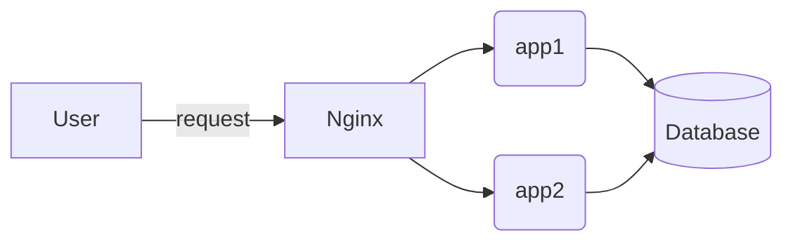

# rinhadebackend

## infra

Este projeto contém um arquivo Makefile para build & deploy da app usando docker compose

### pré reqs

1. docker compose
2. conta + token no dockerhub.com

### Docker compose

O arquivo docker compose contém:

- nginx load balancer
- app 1 
- app 2
- banco de dados postgres

### diagrama

### como usar?

1. Build

Execute "make build-app" para build da imagem usando o código que está na raiz do projeto + arquivo Dockerfile, também presente na raiz.

A imagem é buildada com a tag rinhadebackend.

2. Push

Execute "make push-image". Tenha em mãos o token para envio da imagem para o Dockerhub. Este passo também modifica o arquivo docker-compose.yaml com o endereço da imagem gerada neste passo.

3. Run

Execute "make start-services" para inicar o docker-compose.

4. Local test

Execute make start-services-local-dev para iniciar um docker compose que faz build local da app, ignorando push, etc. Ideal para testes.

5. Stop 
   
Execute "make stop" para encerrar qualquer container em execução.

6. Enjoy